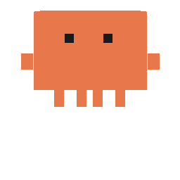

# Jellyfish Desktop Pet

A pixel-art desktop jellyfish companion — Claude's avatar living on your desktop. It shows real-time AI states, accepts file drops for analysis, auto-hides to screen edges, and supports multiple skins.



## Features

- **8 Live States** — idle, thinking, responding, executing, reading, waiting for choice, error, done — each with unique animations, emoji, and sound effects
- **Edge Auto-Hide** — drag to screen edge, it shrinks to a 3px glow strip; hover to expand
- **File Drop + AI** — drop any text file onto the jellyfish, it reads the content and asks AI to analyze it (supports Claude API / Claude Code CLI / OpenAI-compatible backends)
- **Expand Panel** — hover 1 second to reveal a panel with progress bar, task name, speed, and AI response; copy button and pin support
- **5 Built-in Skins** — Coral, Pink Pearl, Neon Purple, Golden Sun, Ghost White — plus custom skin support
- **HTTP API** — control remotely via `POST :19527/status`, `POST :19527/skin`, `GET :19527/ping`
- **Sound Effects** — synthesized via Web Audio API, no external files needed
- **Multilingual** — Chinese / English switchable
- **Cross-Platform** — Windows, macOS, Linux

## Quick Start

```bash
git clone https://github.com/tianshishe1989/jellyfish-pet.git
cd jellyfish-pet
npm install
npm start
```

## Build

```bash
npm run build
```

## HTTP API

```bash
# Change state
curl -X POST http://localhost:19527/status \
  -H "Content-Type: application/json" \
  -d '{"state":"thinking"}'

# Switch skin
curl -X POST http://localhost:19527/skin \
  -H "Content-Type: application/json" \
  -d '{"skin":"neon-purple"}'

# Health check
curl http://localhost:19527/ping

# With progress (shown in panel)
curl -X POST http://localhost:19527/status \
  -H "Content-Type: application/json" \
  -d '{"state":"executing","taskName":"npm install","progress":65,"speed":"2.3 MB/s"}'
```

## AI Setup

1. Right-click tray icon → Settings → AI Settings → choose backend
2. For Claude API: set API key in `ai-config.json` (open via tray menu)
3. For Claude Code CLI: ensure `claude` is in PATH
4. Drop a text file onto the jellyfish — it reads, queries AI, and shows the result in the panel

## Tech Stack

- Electron 33
- Vanilla HTML/CSS/JS
- Web Audio API
- Pixel-art CSS rendering

## License

MIT
